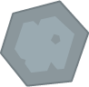

 

# Asteroid Attack | Project Touchstone #
[How To Make Asteroids in Godot 4 (Complete Tutorial)](https://www.youtube.com/watch?v=FmIo8iBV1W8&t) by [Kaan Alpar](https://www.youtube.com/@KaanAlpar) ([GitHub](https://github.com/KaanAlpar))

# Assets #
[Asteroid Attack Assets](https://github.com/KaanAlpar/asteroids_tutorial/tree/main/assets) by [Kaan Alpar](https://www.youtube.com/@KaanAlpar) ([GitHub](https://github.com/KaanAlpar))

# Create a Godot task #
<ins> What application is this task for? </ins>
 
Godot

### **Task prompt** ###
First, enter the **task prompt** and any relevant reference files (e.g., docs, diagrams, sketches, photos, schematics).

Tasks should sound like what a manager might give a skilled but junior employee: high-level guidance with some leeway on executional details, but with very clear success metrics. What a good outcome looks like must be very clear and easy to understand.

Please include any relevant **reference files** (e.g., docs, diagrams, sketches, photos, schematics) needed to complete this task.

Reminder on the difference between reference and starting state files:
- **Reference files**: anything the Employee should look at or read while completing the project that does not need to be directly loaded into the application (*'please make something that looks like XYZ image'*)
- **Starting state files (upload below)**: anything that the Employee would need to load into their workspace to complete the task (*'here is the existing file you should adapt'*)

<ins> Task prompt (ask the Employee) </ins>
 

<ins> Which of the following best fits this task? </ins>
 
Task from scratch

<ins> How long would you anticipate an 'Employee' to complete this task? (in hours) </ins>
 
4

### **Starting state** ###
Please describe and include below any information about the starting state of this project:
- Existing work to be modified
- Other assets or other inputs the Employee needs to bring to be able to complete this task

Reminder on the difference between the starting state and the reference files:
- **Starting state files**: anything that the Employee would need to load into their workspace to complete the task ('*here is the existing file you should adapt*')
- **Reference files (upload above)**: anything the Employee should look at or read while completing the project that does not need to be directly loaded into the application ('*please make something that looks like XYZ image*')

<ins> Starting state description </ins>
 
The starting state files begin with an otherwise empty 2D arcade project containing no implemented gameplay systems, scenes, scripts, enemy behaviors, scoring systems, or combat mechanics beyond the default project structure. The provided materials consist of visual, audio, and font assets intended to support the development of a space-themed asteroid survival and shooting game focused on piloting a player-controlled spacecraft while avoiding and destroying incoming hazards. These assets include multiple asteroid sprites of varying sizes, player ship textures, laser projectile graphics, UFO enemy sprites, particle textures, life indicator icons, a scrolling starfield background, a custom display font for interface elements and score tracking, background music, and several sound effects for lasers, collisions, explosions, damage feedback, and gameplay events. The Employee is responsible for designing and implementing the complete gameplay experience from the ground up using the provided assets, including all required scenes, scripts, movement systems, projectile mechanics, enemy spawning logic, asteroid behaviors, collision handling, health and life management, scoring systems, particle effects, animation and audio playback, game over and restart functionality, and complete game flow management. All gameplay programming, combat interactions, visual effects integration, and project organization must be fully created and assembled by the Employee using the supplied resources as the foundation for the gameplay experience.

### **Overall context** ###
Finally, include context on this task and why it is realistic and representative of real-life work:
- Why is this a reasonable task for a manager to ask a junior-level employee to do?
- Is there a larger project it might be a part of?

<ins> Task context </ins>
 
This task is a realistic and appropriate assignment for a junior-level developer, as it focuses on implementing the core mechanics of a space-themed arcade shooter using the provided visual and audio assets. It involves building essential gameplay systems, including player-controlled spacecraft movement, projectile firing mechanics, asteroid spawning and movement behavior, collision detection, score tracking, screen-wrapping logic, particle and explosion effects, and game over and restart functionality. The work requires applying fundamental programming, gameplay logic, and problem-solving skills to transform static assets into a complete interactive gameplay experience while integrating audio feedback, interface systems, and game state management into a cohesive project. This type of task reflects common real-world development practices, where developers must organize project structures, implement reusable gameplay systems, manage scene interactions, and create polished mechanics from a partially prepared project foundation. It could serve as part of a larger project to develop a complete arcade-style design with enemy behavior, progression systems, weapon upgrades, advanced visual effects, and additional gameplay modes. By implementing these foundational gameplay systems, the task creates an expandable framework that can later support additional mechanics, interface enhancements, visual refinements, and broader gameplay features.

<ins> Rubric Items </ins>
 

 
Godot - https://feather.openai.com/tasks/bf17a2b8-667e-4a2b-9139-8cd6f1c2c46f/stage/prompt_creation - Awaiting response.
